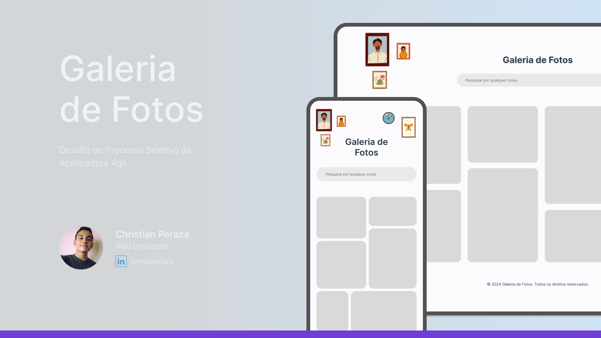

Esta é uma aplicação web que exibe uma galeria de fotos, permitindo que os usuários visualizem, filtrem e pesquisem imagens com base em palavras-chave. Esta aplicação é parte do Processo Seletivo da Aceleradora Ágil, turma 27 - 2025/1º Semestre.

### Tecnologias utilizadas

`HTML5` `CSS3` `JavaScript` `Git` `Vite + React.js`

## Links importantes

- [Deploy link - Netlify](https://image-gallery-challenge.netlify.app/) 🚀
- [Layout e guia de estilo - Figma](https://www.figma.com/design/RCoyNTUgSWi08v1Fcqeu15/Image-Gallery-%7C-Challenge-%7C-Aceleradora-%C3%81gil?node-id=2-2&p=f&t=ll63dKeDCZCLVdOI-0) 🖼️

## Instruções de como rodar a aplicação localmente

**1.** Clona o repositório remoto "image-gallery" no seu computador local.

**2.** Uma vez clonado o repositório, vá para o diretório criado digitando `cd image-gallery`.

**3.** Depois, execute o comando de instalação `npm install` para instalar as dependências.

**4.** Uma vez instaladas as dependências, execute o comando de desenvolvimento `npm run dev` e você poderá começar a usar o aplicativo em seu computador local fazendo **Ctrl+click** no link Local.

```
 npm run dev

  VITE v3.1.8 ready in 396 ms

  > Local: http://localhost:5173/
  > Network: use `--host` to expose
```

> **Nota:** Nota: Para finalizar o desenvolvimento local, basta digitar **Ctrl+C** no terminal.
